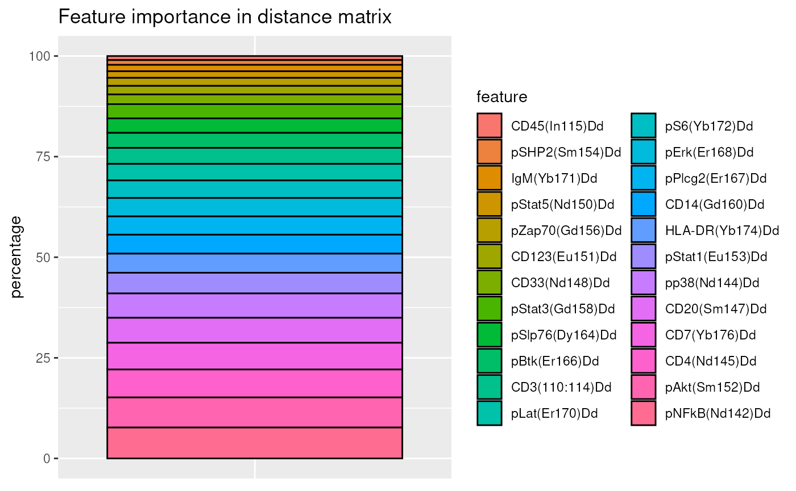
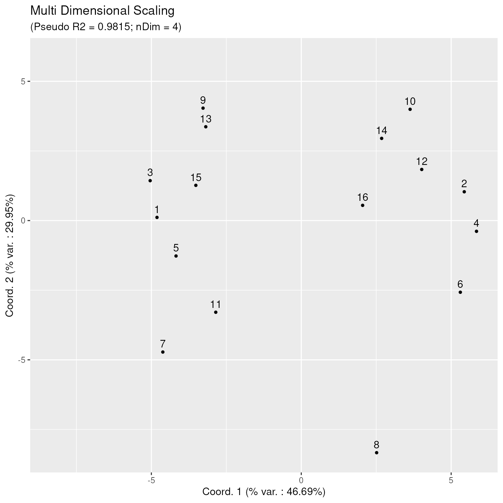
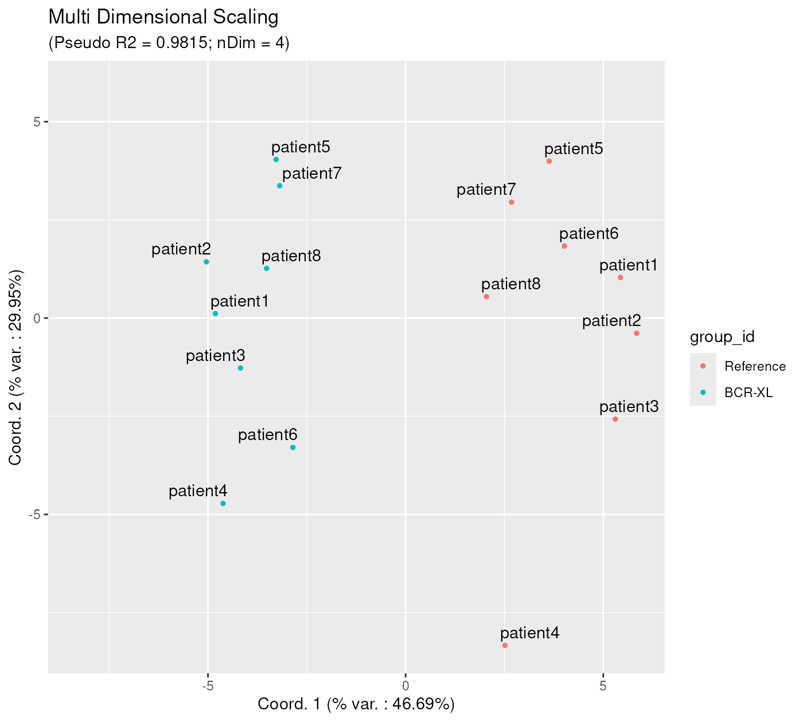
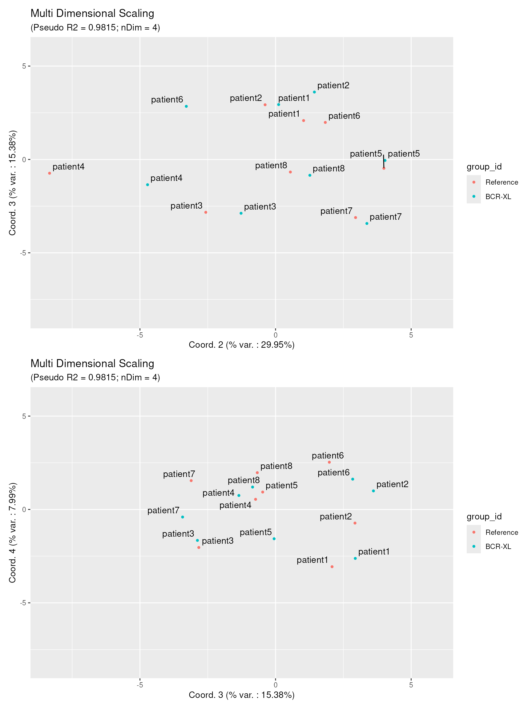
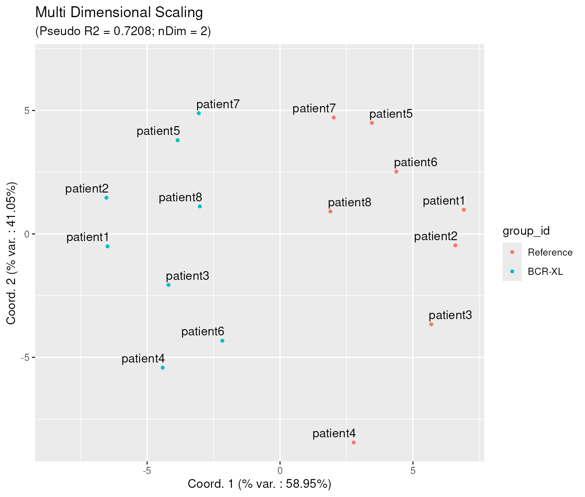
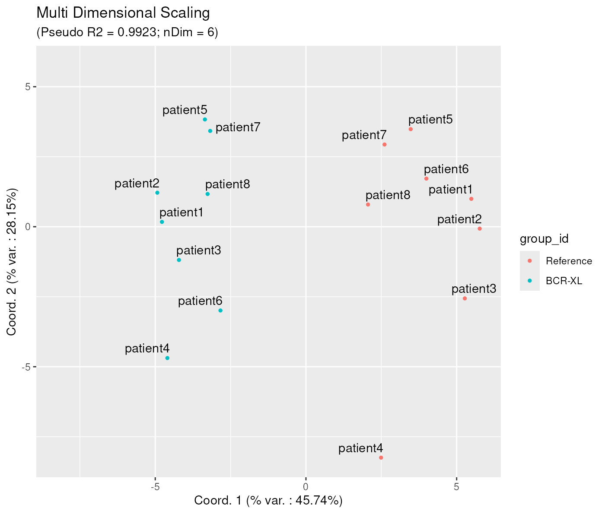
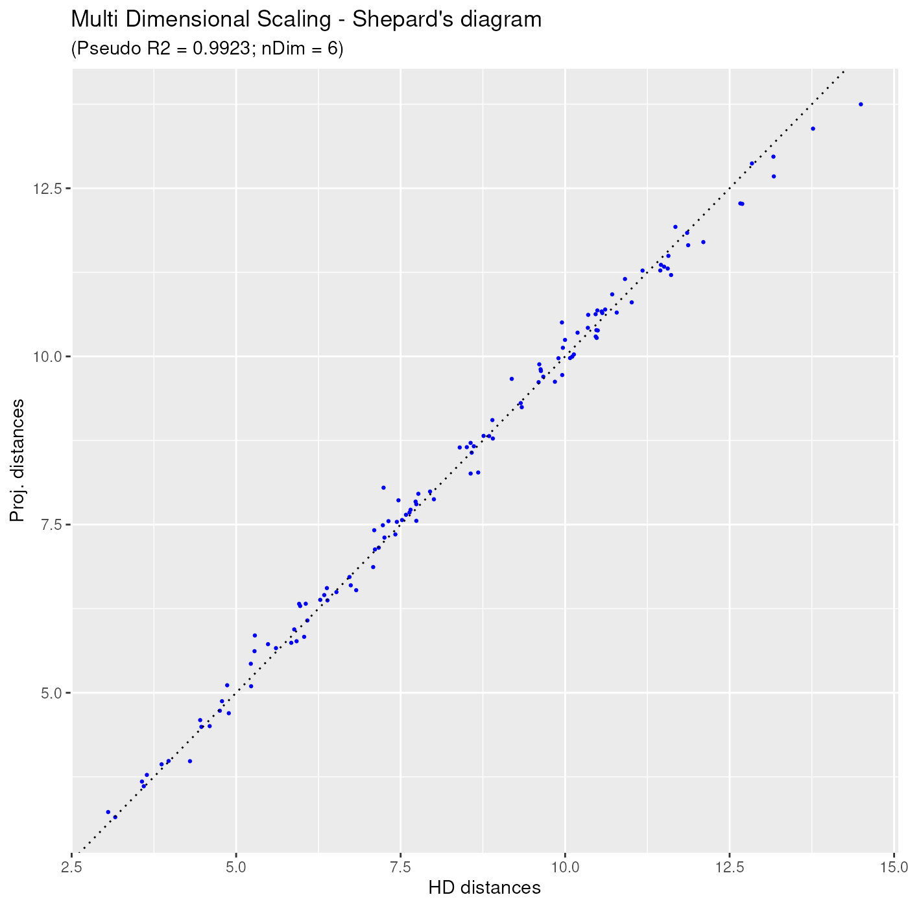
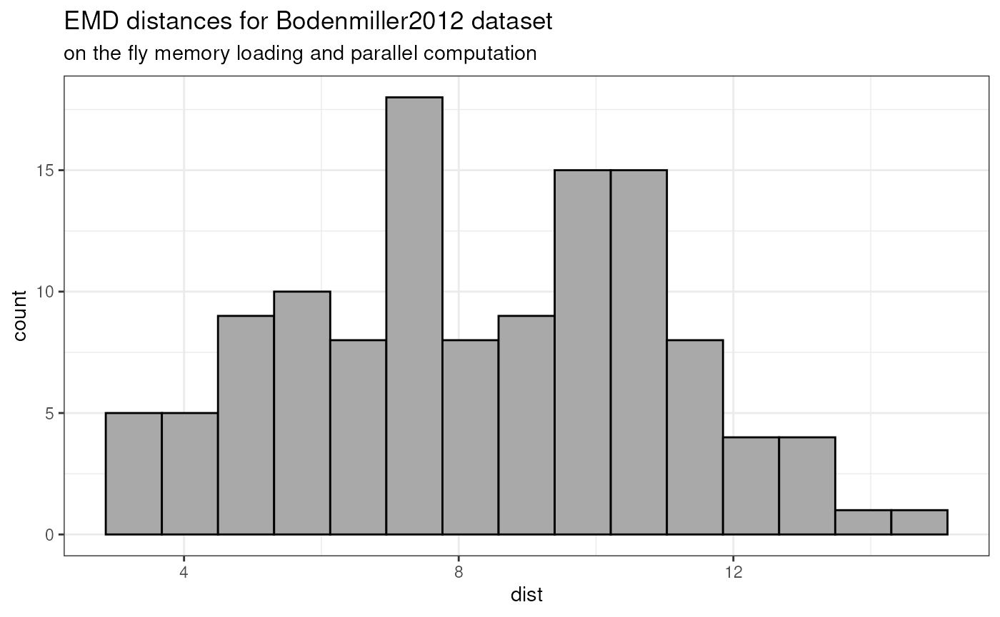
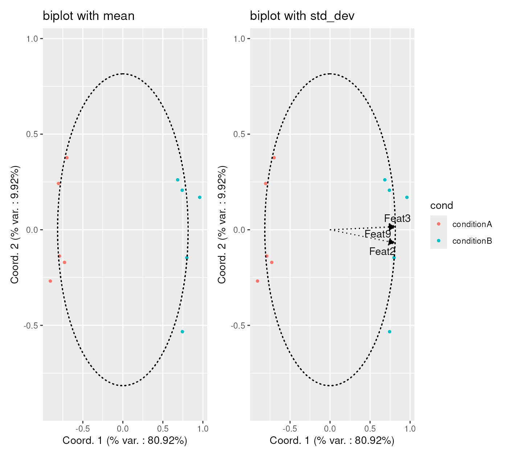

# Low Dimensional Projection of Cytometry Samples

Abstract

This vignette describes the functionality implemented in the `CytoMDS`
package. `CytoMDS` provides support for low dimensional projection of a
set of cytometry samples, using concepts such as Earth Mover’s (EMD)
distance, and Multi Dimensional Scaling (MDS). This vignette is
distributed under a CC BY-SA 4.0 license.

## Installation and loading dependencies

To install this package, start R and enter (un-commented):

``` r

# if (!require("BiocManager", quietly = TRUE))
#     install.packages("BiocManager")
# 
# BiocManager::install("CytoMDS")
```

We now load the packages needed in the current vignette:

``` r

suppressPackageStartupMessages(library(HDCytoData))
library(CytoMDS)
library(ggplot2)
library(patchwork)
```

## Introduction

The `CytoMDS` package implements low dimensional visualization of
cytometry samples, in order to visually assess distances between them.
This, in turn, can greatly help the user to identify quality issues like
batch effects or outlier samples, and/or check the presence of potential
sample clusters that might align with the experimental design.

The `CytoMDS` algorithm combines, on the one hand, the concept of *Earth
Mover’s Distance (EMD)* (Orlova et al. 2016), a.k.a. *Wasserstein
metric* and, on the other hand, the metric *Multi Dimensional Scaling
(MDS)* algorithm for the low dimensional projection (Leeuw and Mair
2009).

Besides projection itself, the package also provides some diagnostic
tools for both checking the quality of the MDS projection, as well as
interpreting the axes of the projection (see below sections).

## Illustrative dataset

The illustrative dataset that is used throughout this vignette is a mass
cytometry (*CyTOF*) dataset from (Bodenmiller et al. 2012), and provided
in the Bioconductor *HDCytoData* data package (Weber and Soneson
(2019)).

This dataset consists of 16 paired samples (8 times 2) of peripheral
blood cells from healthy individuals. Among each sample pair, one
sample - the reference - was left un-stimulated, while the other sample
was stimulated with B cell receptor / Fc receptor cross-linker (BCR-XL).

This public dataset is known to contain a strong differential expression
signal between the two conditions (stimulated vs un-stimulated) and as
been used in recent work to benchmark differential analysis algorithms
((Weber et al. 2019)) and to design mass cytometry data analysis
pipelines ((Nowicka et al. 2017)).

In the `CytoMDS`package, as in the current vignette, matrices of
cytometry events intensities, corresponding to one sample, are stored as
[`flowCore::flowFrame`](https://rdrr.io/pkg/flowCore/man/flowFrame-class.html)
(Ellis et al. 2023) objects. Samples of a particular cytometry dataset
are then stored as a
[`flowCore::flowSet`](https://rdrr.io/pkg/flowCore/man/flowSet-class.html)
object, which is a collection of flowFrame’s, i.e. one flowFrame per
sample. Therefore, we load the flowSet version of the *BodenMiller2012*
dataset, obtained from the `HDCytoData` package.

``` r

BCRXL_fs <- HDCytoData::Bodenmiller_BCR_XL_flowSet()
```

    ## see ?HDCytoData and browseVignettes('HDCytoData') for documentation

    ## loading from cache

    ## Warning in updateObjectFromSlots(object, ..., verbose = verbose): dropping
    ## slot(s) 'colnames' from object = 'flowSet'

``` r

BCRXL_fs
```

    ## A flowSet with 16 experiments.
    ## 
    ## column names(39): Time Cell_length ... sample_id population_id

In regular flowSet’s, the experimental design information is typically  
stored in the `phenoData` slot, and this is also the way `CytoMDS`
expects to get its input. However, `HDCytoData` has chosen to store the
experimental design information in a slightly different way, hence the
need to convert the data as follows:

``` r

phenoData <- flowCore::pData(BCRXL_fs)
additionalPhenoData <- 
    keyword(BCRXL_fs[[1]], "EXPERIMENT_INFO")$EXPERIMENT_INFO
phenoData <- cbind(phenoData, additionalPhenoData)

flowCore::pData(BCRXL_fs) <- phenoData
```

We also select channels/markers that are biologically relevant,
i.e. both the cell type and cell state markers, and store them for
further use. We discard the typical housekeeping markers that are founds
in flowFrames like *time* and Cell_length, etc. In total, these mass
cytometry samples contain intensities for 24 biologically relevant
markers.

``` r

markerInfo <- keyword(BCRXL_fs[[1]], "MARKER_INFO")$MARKER_INFO
chClass <- markerInfo$marker_class

table(chClass)
```

    ## chClass
    ##  none  type state 
    ##    11    10    14

``` r

chLabels <- markerInfo$channel_name[chClass != "none"]
(chMarkers <- markerInfo$marker_name[chClass != "none"])
```

    ##  [1] "CD3"    "CD45"   "pNFkB"  "pp38"   "CD4"    "CD20"   "CD33"   "pStat5"
    ##  [9] "CD123"  "pAkt"   "pStat1" "pSHP2"  "pZap70" "pStat3" "CD14"   "pSlp76"
    ## [17] "pBtk"   "pPlcg2" "pErk"   "pLat"   "IgM"    "pS6"    "HLA-DR" "CD7"

The first step consists in scale transforming the raw data. Indeed,
distances between samples make more sense with scaled transformed
signal, in which distributional differences are more readable and usable
for downstream analysis.

Here, since we are dealing with mass cytometry samples, we use the
classical `arcsinh()` transformation with 5 as *co-factor*, as described
elsewhere ((Nowicka et al. 2017)).

``` r

trans <- arcsinhTransform(
    transformationId="ArcsinhTransform", 
    a = 0, 
    b = 1/5, 
    c = 0)

BCRXL_fs_trans <- transform(
    BCRXL_fs,
    transformList(chLabels, trans))
```

## Pairwise sample Earth Mover’s Distances

### Calculating distances between samples

We can now calculate pairwise *Earth Mover’s Distances (EMD)* between
all samples of our dataset.

This is done by calling the
[`pairwiseEMDDist()`](https://uclouvain-cbio.github.io/CytoMDS/reference/pairwiseEMDDist.md)
method The simplest way to  
use this method is by providing directly a
[`flowCore::flowSet`](https://rdrr.io/pkg/flowCore/man/flowSet-class.html),
containing all samples, as input parameter. Note that, for heavy
datasets that include a lot of samples, this can create memory issues.
To handle this case, `CytoMDS` provides other ways to call the
[`pairwiseEMDDist()`](https://uclouvain-cbio.github.io/CytoMDS/reference/pairwiseEMDDist.md)
function (see ‘Handling heavy datasets’ section).

Using the `channels` argument, it is possible to restrict the EMD
calculation to some of the channels. Here we simply pass as input the
biologically relevant markers selected in the previous section.

``` r

pwDist <- pairwiseEMDDist(
    BCRXL_fs_trans,
    channels = chMarkers,
    verbose = FALSE
)
pwDistMatrix <- as.matrix(pwDist)
```

The return value of the `pairwiseEMDDist` function is a `DistSum`
object. We can use the
[`as.matrix()`](https://rdrr.io/r/base/matrix.html) method to to convert
this object into a matrix, here a symmetric square matrix, with as many
rows (columns) as input samples (extract shown here below for the
scale-transformed *Bodenmiller2012* dataset).

``` r

round(pwDistMatrix[1:10, 1:10], 2)
```

    ##        1     2     3     4     5     6     7     8     9    10
    ## 1   0.00 10.46  4.30 11.18  6.39 12.69  7.11 11.85  5.88 10.13
    ## 2  10.46  0.00 10.91  3.16 11.45  6.06 13.17 10.61  9.61  6.08
    ## 3   4.30 10.91  0.00 10.72  7.44 13.17  7.47 12.84  5.84 10.00
    ## 4  11.18  3.16 10.72  0.00 12.10  5.97 12.66  9.63 10.35  6.72
    ## 5   6.39 11.45  7.44 12.10  0.00  9.19  4.45 10.19  5.28  9.96
    ## 6  12.69  6.06 13.17  5.97  9.19  0.00 10.56  7.23 11.61  7.74
    ## 7   7.11 13.17  7.47 12.66  4.45 10.56  0.00  7.24  8.89 11.87
    ## 8  11.85 10.61 12.84  9.63 10.19  7.23  7.24  0.00 14.50 11.68
    ## 9   5.88  9.61  5.84 10.35  5.28 11.61  8.89 14.50  0.00  7.10
    ## 10 10.13  6.08 10.00  6.72  9.96  7.74 11.87 11.68  7.10  0.00

One relevant way to visualize this distance matrix is to draw the
histogram of pairwise distances, as shown in the below plot.

``` r

distVec <- pwDistMatrix[upper.tri(pwDist)]
distVecDF <- data.frame(dist = distVec)
pHist <- ggplot(distVecDF, mapping = aes(x=dist)) + 
    geom_histogram(fill = "darkgrey", col = "black", bins = 15) + 
    theme_bw() + ggtitle("EMD distances for Bodenmiller2012 dataset")
pHist
```


### Individual marker contribution in the distance matrix

Since in *CytoMDS*, the *EMD* is calculated as an approximation, summing
over the one-dimensional marginal marker unidimensional distributions,
it is possible to obtain an individual contribution of each marker to
the distance matrix. This can be done using the
[`distByFeature()`](https://uclouvain-cbio.github.io/CytoMDS/reference/DistSum-class.md)
method:

``` r

DF <- distByFeature(pwDist)
DF[order(DF$percentage, decreasing = TRUE),]
```

    ##        featureName distanceContrib percentage
    ## 3   pNFkB(Nd142)Dd      0.64393915   7.712532
    ## 10   pAkt(Sm152)Dd      0.62152388   7.444062
    ## 5     CD4(Nd145)Dd      0.58168675   6.966928
    ## 24    CD7(Yb176)Dd      0.55242877   6.616502
    ## 6    CD20(Sm147)Dd      0.51833588   6.208167
    ## 4    pp38(Nd144)Dd      0.50751539   6.078569
    ## 11 pStat1(Eu153)Dd      0.42774647   5.123168
    ## 23 HLA-DR(Yb174)Dd      0.39561819   4.738364
    ## 15   CD14(Gd160)Dd      0.39493170   4.730142
    ## 18 pPlcg2(Er167)Dd      0.38095496   4.562741
    ## 19   pErk(Er168)Dd      0.38044973   4.556689
    ## 22    pS6(Yb172)Dd      0.36274288   4.344613
    ## 20   pLat(Er170)Dd      0.34287354   4.106635
    ## 1   CD3(110:114)Dd      0.33383030   3.998323
    ## 17   pBtk(Er166)Dd      0.31021456   3.715475
    ## 16 pSlp76(Dy164)Dd      0.29994305   3.592452
    ## 14 pStat3(Gd158)Dd      0.29659401   3.552340
    ## 7    CD33(Nd148)Dd      0.20340106   2.436158
    ## 9   CD123(Eu151)Dd      0.17773632   2.128768
    ## 13 pZap70(Gd156)Dd      0.16365740   1.960143
    ## 8  pStat5(Nd150)Dd      0.13870620   1.661300
    ## 21    IgM(Yb171)Dd      0.13134337   1.573114
    ## 12  pSHP2(Sm154)Dd      0.09837732   1.178276
    ## 2    CD45(In115)Dd      0.08470643   1.014538

These individual marker contributions can also be displayed visually,
using the
[`ggplotDistFeatureImportance()`](https://uclouvain-cbio.github.io/CytoMDS/reference/ggplotDistFeatureImportance.md)
method:

``` r

pBar <- ggplotDistFeatureImportance(pwDist)
pBar
```



## Metric Multidimensional scaling

### Calculating the MDS projection

Once the pairwise distance matrix has been calculated, computing the
*Multi Dimensional Scaling (MDS)* projection is done by calling the
[`computeMetricMDS()`](https://uclouvain-cbio.github.io/CytoMDS/reference/computeMetricMDS.md)
function. In its simplest form, only the distance `DistSum` object (or a
distance matrix) needs to be passed to the function. In that case, the
number of dimensions to use in the MDS is automatically set in order to
reach a specific value for a projection quality indicator, i.e. the
*target pseudo R square*, which in turn is set by default to 0.95 (see
Quality of projection - diagnostic tools section).

Note that the *Smacof* algorithm (Leeuw and Mair 2009), used to compute
the MDS projection, is stochastic, so it is sensitive to the ‘seed’
used. Therefore, in cases where reproducible results from one run to
another is required, it is advised to set the `seed` argument to a fixed
value.

The returned value of the
[`computeMetricMDS()`](https://uclouvain-cbio.github.io/CytoMDS/reference/computeMetricMDS.md)
function is an object of the *MDS* class. This object can be queried to
get e.g. the number of dimensions that was effectively used, or the
obtained pseudo RSquare, as shown in the following code chunk:

``` r

mdsObj <- computeMetricMDS(pwDist, seed = 0)
show(mdsObj)
```

    ## MDS object containing MDS projection (using Smacof algorithm)  data:
    ## Nb of dimensions:  4 
    ## Nb of points:  16 
    ## Stress:  0.040668 
    ## Pseudo RSquare:  0.981489 
    ## Goodness of fit:  0.998346

### Plotting the MDS projection

Plotting the obtained MDS projection is done using
[`ggplotSampleMDS()`](https://uclouvain-cbio.github.io/CytoMDS/reference/ggplotSampleMDS.md).
If no `phenoData` parameter is passed, then, by default, numbers are
used as labels, and samples are represented as black dots.

``` r

ggplotSampleMDS(mdsObj)
```



However, by providing a ‘phenoData’ dataframe to the
[`ggplotSampleMDS()`](https://uclouvain-cbio.github.io/CytoMDS/reference/ggplotSampleMDS.md)
function, the corresponding variables can be used for highlighting
sample points with different colours and/or shapes. Here below, the
previous plot is enhanced with red and blue colours, distinguishing
samples from the two conditions. Also, we have added more meaningful
labels to each data point, corresponding to patient id’s.

On this plot, one can clearly see a clear separation between samples of
the two different conditions. These 2 sample groups are different along
the x axis, which corresponds to the first projection direction,
explaining 46.69 % of the variability contained in the MDS projection
with 4 dimensions (as indicated in the subtitle). This clear separation
between 2 condition clusters highlights the strong biological signal
differentiating these two groups of samples. Further in this vignette,
we shall try to assign a user interpretation to this x axis direction
(see ‘Aid to interpreting projection axes’ section).

``` r

p12 <- ggplotSampleMDS(
    mdsObj,
    pData = phenoData,
    projectionAxes = c(1,2),
    pDataForColour = "group_id",
    pDataForLabel = "patient_id"
)
p12
```



Given that 4 dimensions were used in the metric MDS algorithm, the user
can visualize the MDS projection using any combination of two axes, for
example axes 2 and 3, or 3 and 4, as below:

``` r

p23 <- ggplotSampleMDS(
    mdsObj,
    pData = phenoData,
    projectionAxes = c(2,3),
    pDataForColour = "group_id",
    pDataForLabel = "patient_id"
)

p34 <- ggplotSampleMDS(
    mdsObj,
    pData = phenoData,
    projectionAxes = c(3,4),
    pDataForColour = "group_id",
    pDataForLabel = "patient_id"
)
p23 / p34
```



These plots reveal two important findings: 1. Dots of the 2 samples
groups are well-mixed in both views, showing that the biological
difference between the two sample groups is mainly concentrated along
the first projection axis. 2. Dots corresponding to samples from the
same patient id are most of the time very close to each other. We could
conclude that the variability contained in axes 2, 3 and 4 mostly
represent biological variation between different individuals, and not
(or much less) the effect of stimulation.

### Quality of projection - diagnostic tools

In order to be able to trust the projected distances obtained on the
`CytoMDS` plots, a couple of projection quality indicators can be
verified : - the *pseudo RSquare* indicator shows what percentage of the
variability contained in the pairwise distance matrix is actually
contained in the low dimensional MDS projection. It is analog to the
statistical *RSquare* for a linear regression model, i.e. the closer to
one the *pseudo RSquare* is, the better. Note that the *pseudo RSquare*
refers to the variability contained in **ALL** dimensions of the MDS
projection, not only the two plotted axes. - *nDim* is the number of
dimensions of the projection that was needed to obtain the corresponding
*pseudo RSquare* (here 4 dimensions). - the percentage of variation that
is captured along each axis (coordinates), is to be interpreted with
respect to the total variability **that is captured by the MDS
projection**, not the total variability.

For example, in the previous section, the MDS projection using 4
dimensions is able to capture 98.15% (*pseudo RSquare*) of the initial
variability contained in the calculated pairwise distance matrix. **Of
these 98.15%**, 46.69% is in turn captured by axis 1, 29.95% is captured
by axis 2, 15.38% is captured by axis 3 and 7.99% is captured by axis 4.

Another useful projection quality diagnostic tool is the *Shepard
diagram*. On this diagram, each dot represents a single distance between
a sample pair, with as x coordinate the original (high dimensional)
distance between the two samples, and as y coordinate the projected low
dimensional distance, as obtained by the MDS projection algorithm.

In the *Shepard* diagram, the ideal situation is when all dots are
located on a straight line passing through the (0,0) and (1,1) points.
In the below diagram, one can notice that all points are very near the
ideal straight line, hence the distance projections can be trusted.

``` r

ggplotSampleMDSShepard(mdsObj)
```


### Additional options for the MDS projection

In this section, we describe a couple of additional options available to
the user when calculating the MDS projection using
[`computeMetricMDS()`](https://uclouvain-cbio.github.io/CytoMDS/reference/computeMetricMDS.md).

First, instead of letting the algorithm choose itself the number of
dimensions, it is also possible to assign it explicitly, for example to
2, as in below:

``` r

 mdsObj2 <- CytoMDS::computeMetricMDS(pwDist, seed = 0, nDim = 2)
 ggplotSampleMDS(mdsObj2,
                 pData = phenoData,
                 projectionAxes = c(1,2),
                 pDataForColour = "group_id",
                 pDataForLabel = "patient_id",
                 flipYAxis = TRUE)
```



Note that the obtained projection on 2 axes, although similar, is not
exactly the same as the one obtained when visualizing the first two axis
of the MDS projection obtained before, with 4 dimensions. Actually, this
is a feature of the Metric MDS projection, although it might appear a
bit counter-intuitive at first.

Second, it is also possible to adjust the number of dimensions
indirectly, by setting an explicit *pseudo Rsquare* target. In that case
the algorithm will increase the number of dimensions until reaching the
required quality target, instead of the by default 0.95 target.

The below example shows how to obtain a *pseudo R Square* of at least
0.99. As a result, the needed number of dimensions is now 6, instead of
4.

``` r

mdsObj3 <- CytoMDS::computeMetricMDS(pwDist, seed = 0, targetPseudoRSq = 0.99)
ggplotSampleMDS(mdsObj3,
                 pData = phenoData,
                 projectionAxes = c(1,2),
                 pDataForColour = "group_id",
                 pDataForLabel = "patient_id")
```



The corresponding Shepard diagram is obtained as below, showing that the
dots are even more concentrated around the ideal straight line, than
before:

``` r

ggplotSampleMDSShepard(mdsObj3)
```



### Aid to interpreting projection axes

#### Bi-plots

With MDS projections, it is possible to (try to) associate some axis
directions to specific sample characteristics. The idea is to calculate
the correlation of well chosen sample statistics w.r.t. the axes of
projection, so that these correlations can be represented on a
correlation circle, which is overlaid on the projection plot. This plot
set-up is called a ‘bi-plot’.

In order produce a bi=plot, the user first needs to calculate chosen
statistics of interest for which they want to assess the association
with the axis directions. Typically, one chooses channel specific
statistics, like e.g. the mean, the standard deviation, or any quantile
that might be of interest. However, any statistics that can be
calculated for each sample can be used (number of events,…)

Here below, we provide an example where the user overlays the median of
the different channels, on a bi-plot with MDS projection axes 1 and 2.

On the bi-plot, each arrow - here representing a channel median - is
located at coordinates equal to its respective Pearson correlation
w.r.t. the two axis.

Here, one can identify that the x axis has a strong positive correlation
with the median of markers ‘CD4’, ‘CD33’, ‘CD20’, ‘pNFkB’, ‘pp38’,
‘pBtk’ and ‘pSlp76’, and a strong negative correlation with the median
of marker ‘HLA-DR’. The y axis has a strong negative correlation with
the median of a number of markers: ‘CD123’, ‘pStat1’, ‘pStat5’, ‘pSHP2’,
‘pAkt’, ‘pZap70’ and ‘pPlcg2’.

``` r

medians <- channelSummaryStats(BCRXL_fs_trans, 
                               channels = chLabels, 
                               statFUNs = median)
```

``` r

ggplotSampleMDS(mdsObj,
                pData = phenoData,
                pDataForColour = "group_id",
                displayPointLabels = FALSE,
                displayArrowLabels = TRUE,
                repelArrowLabels = TRUE,
                biplot = TRUE,
                extVariables = medians)
```


Note that, on the bi-plots, only the arrows of length greater or equal
to a specific threshold (by default set at 0.8) are represented, in
order to not overwhelm the plot with arrows, especially when the dataset
uses a high dimensional panel.

It is however possible to adjust this threshold by explicitly setting
the `arrowThreshold` argument. For example, in the below plot, the
threshold is set set to 0.6, showing, for example, that x axis is also
strongly negatively correlated with the median of ‘pS6’ and ‘CD7’
markers.

``` r

ggplotSampleMDS(mdsObj,
                pData = phenoData,
                pDataForColour = "group_id",
                displayPointLabels = FALSE,
                displayArrowLabels = TRUE,
                repelArrowLabels = TRUE,
                biplot = TRUE,
                extVariables = medians,
                arrowThreshold = 0.6)
```


In terms of biological interpretation, since the x axis is the direction
along which there is a clear separation between stimulated and
(reference) un-stimulated samples, the biplot suggests that channels for
which the median appears as strongly correlated with the x axis, should
also show visible distributional difference between the two sample
groups.

In order to check this, we can use the `ggplotMarginalDensities` method
provided in the `CytoMDS` package, as follows:

``` r

ggplotMarginalDensities(
    BCRXL_fs_trans, 
    channels = chLabels,
    pDataForColour = "group_id",
    pDataForGroup = "sample_id")
```

 And indeed,
we can notice that the Reference samples (in red) tend to show higher
intensity values for markers ‘pNFkB’, ‘pp38’, ‘CD4’, ‘CD20’, ‘CD33’,
‘pSlp76’, ‘pBtk’, while BCR-XL stimulated samples (in blue) tend to show
higher internsity valeus for markers ‘pS6’, ‘HLA-DR’ and ‘CD7’. All
these markers where identified as strongly (resp. positively and
negatively) correlated with the x axis on the bi-plot.

#### Bi-plot wrapping

Instead of drawing one single bi-plot related to a specific type of
statistics, for example channel medians as before, we can also try to
associate the axes to different channel statistics at once. In the next
plot, we draw bi-plots for channel medians, 25% and 75% quantiles, and
standard deviations at once.

The ‘facets-alike’ bi-plot, or *bi-plot wrapping*, is obtained thanks to
the
[`ggplotSampleMDSWrapBiplots()`](https://uclouvain-cbio.github.io/CytoMDS/reference/ggplotSampleMDSWrapBiplots.md)
function, which internally calls
[`ggplotSampleMDS()`](https://uclouvain-cbio.github.io/CytoMDS/reference/ggplotSampleMDS.md)
function several times, and arrange the obtained outputs on a single
plot.

``` r

statFUNs = c("median" = stats::median,
             "Q25" = function(x, na.rm) {
                 stats::quantile(x, probs = 0.25)
             },
             "Q75" = function(x, na.rm) {
                 stats::quantile(x, probs = 0.75)
             },
             "standard deviation" = stats::sd)
chStats <- channelSummaryStats(BCRXL_fs_trans,
                               channels = chLabels, 
                               statFUNs = statFUNs)
```

``` r

ggplotSampleMDSWrapBiplots(
    mdsObj,
    extVariableList = chStats,
    ncol = 2,
    pData = phenoData,
    pDataForColour = "group_id",
    displayPointLabels = FALSE,
    displayArrowLabels = TRUE,
    repelArrowLabels = TRUE,
    displayLegend = FALSE)
```


Sometimes, as is the case on the plots below, a high number of channel
statistics are strongly correlated with the bi-plot axes, so that the
plot is hardly readable, due to too many arrows displayed.

In that case, it is advised to generate series of bi-plots, part of the
channel statistics, in order to better identify the strongly correlated
ones. One example is provided below, showing the correlation between the
axes and the standard deviation of each channel:

``` r

stdDevs <- list(
    "std dev of channels 1 to 6" = chStats[["standard deviation"]][,1:6],
    "std dev of channels 7 to 12" = chStats[["standard deviation"]][,7:12],
    "std dev of channels 13 to 18" = chStats[["standard deviation"]][,13:18],
    "std dev of channels 19 to 24" = chStats[["standard deviation"]][,19:24]
)

ggplotSampleMDSWrapBiplots(
    mdsObj,
    ncol = 2,
    extVariableList = stdDevs,
    pData = phenoData,
    pDataForColour = "group_id",
    displayPointLabels = FALSE,
    displayArrowLabels = TRUE,
    repelArrowLabels = TRUE)
```


## Handling large datasets

Computing Earth Mover’s Distances between all sample pairs of large
datasets (e.g. with hundreds of samples), is a heavy computational task.

First, loading the whole data set as a
[`flowCore::flowSet()`](https://rdrr.io/pkg/flowCore/man/flowSet-class.html)
in RAM at once, might not be possible due to its size. Second,
calculating a matrix of pairwise distances, has a computational
complexity of O(N2), which can lead to very long computation times for
large datasets.

Therefore, the `CytoMDS` package provides several mechanisms allowing to
mitigate these issues.

### Loading flow frames dynamically during distance matrix computation

In order to be able to handle datasets of greater size than the
available computer RAM, the
[`pairwiseEMDDist()`](https://uclouvain-cbio.github.io/CytoMDS/reference/pairwiseEMDDist.md)
function allows for an alternative input mode, where: - the input
samples are NOT provided directly via a
[`flowCore::flowSet`](https://rdrr.io/pkg/flowCore/man/flowSet-class.html),
or  
a list of expression matrices, but - the user provides the nb of
samples, and a user-written expression matrix loading function that will
be called to dynamically load the *i*th sample - as an expression
matrix - upon request, and optionally additional arguments.

Typically, the expression matrix loading function provided by the user
shall describe how to read the *i*th sample from disk.

### Using BiocParallel to parallelize distance matrix computation

Also, `CytoMDS` pairwise distance calculation supports parallelization
of distance matrix computation, through the use of `BiocParallel`
package.

When parallelization is used, the calculation engine will automatically
create worker tasks corresponding to the calculation of blocks of the
distance matrix.

In the below, we provide an example with the BodenMiller2012 dataset.
Note that this example has illustrative purpose only, as in fact this
dataset is small enough to fully reside in memory and to not require
parallelization of distance calculation.

In case where ‘on-the-fly’ expression matrices in-memory loading is
required, we advise, as a preliminary step, to store the samples,
previously scale transformed, on disk. Here we do it in a temporary
directory.

``` r

storageLocation <- suppressMessages(base::tempdir())

nSample <- length(BCRXL_fs_trans)
fileNames <- file.path(
    storageLocation,
    paste0("BodenMiller2012_TransformedSample", 
           sprintf("%02d.rds", seq_len(nSample))))

for (i in seq_len(nSample)) {
    saveRDS(BCRXL_fs_trans[[i]],
            file = fileNames[i])
}
```

Then, the
[`pairwiseEMDDist()`](https://uclouvain-cbio.github.io/CytoMDS/reference/pairwiseEMDDist.md)
method can be called, now specifying a number of samples, a expression
matrix loading function, and a
[`BiocParallel::SnowParam()`](https://rdrr.io/pkg/BiocParallel/man/SnowParam-class.html)
backbone for parallelization of the computations.

``` r

bp <- BiocParallel::SnowParam(
    stop.on.error = FALSE,
    progressbar = TRUE)
pwDistLast <- suppressWarnings(pairwiseEMDDist(
    x = nSample,
    channels = chMarkers,
    loadExprMatrixFUN  = function(exprMatrixIndex, files, channels, markers){
        ff <- readRDS(file = files[exprMatrixIndex ])
        exprMat <- flowCore::exprs(ff)[, channels, drop = FALSE]
        colnames(exprMat) <- markers
        exprMat
    },
    loadExprMatrixFUNArgs = list(
        files = fileNames, 
        channels = chLabels,
        markers = chMarkers),
    BPPARAM = bp))
```

    ##   |                                                                              |                                                                      |   0%  |                                                                              |==================                                                    |  25%  |                                                                              |===================================                                   |  50%  |                                                                              |====================================================                  |  75%  |                                                                              |======================================================================| 100%
    ## 
    ##   |                                                                              |                                                                      |   0%  |                                                                              |============                                                          |  17%  |                                                                              |=======================                                               |  33%  |                                                                              |===================================                                   |  50%  |                                                                              |===============================================                       |  67%  |                                                                              |==========================================================            |  83%  |                                                                              |======================================================================| 100%

The obtained distances - as shown in the below histogram - are exactly
the same as before.

``` r

pwDistLastMat <- as.matrix(pwDistLast)
distVecLast <- pwDistLastMat[upper.tri(pwDistLastMat)]
distVecDFLast <- data.frame(dist = distVecLast)
pHistLast <- ggplot(distVecDFLast, mapping = aes(x=dist)) +
    geom_histogram(fill = "darkgrey", col = "black", bins = 15) +
    theme_bw() + 
    ggtitle(
        "EMD distances for Bodenmiller2012 dataset", 
        subtitle =  "on the fly memory loading and parallel computation")
pHistLast
```



## Expression matrices as input instead of flowFrames

Standard use of `CytoMDS` involves providing cytometry sample data,
contained in `flowCore` standard cytometry data structures (`flowSet`
and `flowFrame`) as input to Earth Mover’s distance calculation.

However, `CytoMDS` can also accept more generic input data, as a list of
expression matrices, stored in standard R matrices. For instance, this
allows using `CytoMDS` visualizations for other type of data than
cytometry, as long as each sample can be represented by a matrix with
any number of rows (cells), and fixed columns/features (markers).

Here below is an illustrating toy example with some randomly simulated
data.

Let us first simulate 10 samples with 1,000 rows each and 10 features.
Samples are split into 2 groups: `conditionA` and `conditionB` with some
increased expression std deviation for 3 features in `conditionB`,
compared to `conditionA`.

``` r

nSample <- 10
conditions <- factor(c(rep("conditionA", 5), rep("conditionB", 5)))
nRow <- 1000
nFeat <- 10
nDiffFeat <- 3
diffFeats = c(2, 3, 9)
stdDevFactor = 1.5

exprMatrixList <- mapply(
    seq(nSample),
    conditions,
    FUN = function(i, condition) {
        exprMatrix <- matrix(rnorm(nRow*nFeat), nrow = nRow)
        if (condition == "conditionB") {
            exprMatrix[, diffFeats] <- exprMatrix[, diffFeats] * stdDevFactor
        }
        colnames(exprMatrix) <- paste0("Feat", seq(nFeat))
        exprMatrix
    },
    SIMPLIFY = FALSE
)

names(exprMatrixList) <- paste0("sample", seq(nSample))
```

We can now generate a pairwise sample distance matrix, based on the
previously simulated matrix list, and show the corresponding histogram:

``` r

pwDistExpr <-  pairwiseEMDDist(
    exprMatrixList
)
```

``` r

pwDistExprmat <- as.matrix(pwDistExpr)
distVecExpr <- pwDistExprmat[upper.tri(pwDistExprmat)]
distVecDFExpr <- data.frame(dist = distVecExpr)
pHistExpr <- ggplot(distVecDFExpr, mapping = aes(x=dist)) +
    geom_histogram(fill = "darkgrey", col = "black", bins = 15) +
    theme_bw() + 
    ggtitle(
        "EMD distances for simulated expression matrices")
pHistExpr
```


With the generated pairwise distance matrix, we can now proceed with the
`CytoMDS` workflow, as in the previous examples:

``` r

mdsObjExpr <- computeMetricMDS(pwDistExpr, seed = 0)
show(mdsObjExpr)
```

    ## MDS object containing MDS projection (using Smacof algorithm)  data:
    ## Nb of dimensions:  3 
    ## Nb of points:  10 
    ## Stress:  0.065625 
    ## Pseudo RSquare:  0.972289 
    ## Goodness of fit:  0.995693

``` r

phenoDataExpr <- data.frame(sampleId = seq(nSample), cond = conditions)
p12 <- ggplotSampleMDS(
    mdsObjExpr,
    pData = phenoDataExpr,
    projectionAxes = c(1,2),
    pDataForColour = "cond",
    pDataForLabel = "sampleId"
)
p12
```


``` r

statFunctions <- list(mean = base::mean,
                      std_dev = stats::sd)
chStatsExpr <- channelSummaryStats(exprMatrixList,
                                   statFUNs  = statFunctions)
p <- CytoMDS::ggplotSampleMDSWrapBiplots(
    mdsObj = mdsObjExpr,
    extVariableList = chStatsExpr,
    pData = phenoDataExpr,
    projectionAxes = c(1,2),
    pDataForColour = "cond",
    displayPointLabels = FALSE,
    repelArrowLabels = TRUE,
    ncol = 2,
    arrowThreshold = 0.9
)
p
```



## Session information

    ## R Under development (unstable) (2025-11-22 r89050)
    ## Platform: x86_64-pc-linux-gnu
    ## Running under: Ubuntu 24.04.3 LTS
    ## 
    ## Matrix products: default
    ## BLAS:   /usr/lib/x86_64-linux-gnu/openblas-pthread/libblas.so.3 
    ## LAPACK: /usr/lib/x86_64-linux-gnu/openblas-pthread/libopenblasp-r0.3.26.so;  LAPACK version 3.12.0
    ## 
    ## locale:
    ##  [1] LC_CTYPE=en_US.UTF-8       LC_NUMERIC=C              
    ##  [3] LC_TIME=en_US.UTF-8        LC_COLLATE=en_US.UTF-8    
    ##  [5] LC_MONETARY=en_US.UTF-8    LC_MESSAGES=en_US.UTF-8   
    ##  [7] LC_PAPER=en_US.UTF-8       LC_NAME=C                 
    ##  [9] LC_ADDRESS=C               LC_TELEPHONE=C            
    ## [11] LC_MEASUREMENT=en_US.UTF-8 LC_IDENTIFICATION=C       
    ## 
    ## time zone: UTC
    ## tzcode source: system (glibc)
    ## 
    ## attached base packages:
    ## [1] stats4    stats     graphics  grDevices utils     datasets  methods  
    ## [8] base     
    ## 
    ## other attached packages:
    ##  [1] patchwork_1.3.2             ggplot2_4.0.1              
    ##  [3] CytoMDS_1.7.1               HDCytoData_1.31.0          
    ##  [5] flowCore_2.23.0             SummarizedExperiment_1.41.0
    ##  [7] Biobase_2.71.0              GenomicRanges_1.63.0       
    ##  [9] Seqinfo_1.1.0               IRanges_2.45.0             
    ## [11] S4Vectors_0.49.0            MatrixGenerics_1.23.0      
    ## [13] matrixStats_1.5.0           ExperimentHub_3.1.0        
    ## [15] AnnotationHub_4.1.0         BiocFileCache_3.1.0        
    ## [17] dbplyr_2.5.1                BiocGenerics_0.57.0        
    ## [19] generics_0.1.4              BiocStyle_2.39.0           
    ## 
    ## loaded via a namespace (and not attached):
    ##   [1] splines_4.6.0        filelock_1.0.3       tibble_3.3.0        
    ##   [4] polyclip_1.10-7      graph_1.89.0         XML_3.99-0.20       
    ##   [7] rpart_4.1.24         lifecycle_1.0.4      httr2_1.2.1         
    ##  [10] Rdpack_2.6.4         doParallel_1.0.17    flowWorkspace_4.23.0
    ##  [13] lattice_0.22-7       MASS_7.3-65          backports_1.5.0     
    ##  [16] magrittr_2.0.4       Hmisc_5.2-4          sass_0.4.10         
    ##  [19] rmarkdown_2.30       jquerylib_0.1.4      yaml_2.3.10         
    ##  [22] plotrix_3.8-13       DBI_1.2.3            minqa_1.2.8         
    ##  [25] RColorBrewer_1.1-3   abind_1.4-8          ggcyto_1.39.0       
    ##  [28] purrr_1.2.0          nnet_7.3-20          pracma_2.4.6        
    ##  [31] tweenr_2.0.3         rappdirs_0.3.3       transport_0.15-4    
    ##  [34] ggrepel_0.9.6        gdata_3.0.1          ellipse_0.5.0       
    ##  [37] pkgdown_2.2.0.9000   codetools_0.2-20     DelayedArray_0.37.0 
    ##  [40] ggforce_0.5.0        tidyselect_1.2.1     shape_1.4.6.1       
    ##  [43] farver_2.1.2         lme4_1.1-37          base64enc_0.1-3     
    ##  [46] jsonlite_2.0.0       e1071_1.7-16         mitml_0.4-5         
    ##  [49] Formula_1.2-5        survival_3.8-3       iterators_1.0.14    
    ##  [52] systemfonts_1.3.1    foreach_1.5.2        tools_4.6.0         
    ##  [55] ragg_1.5.0           snow_0.4-4           Rcpp_1.1.0          
    ##  [58] glue_1.8.0           gridExtra_2.3        pan_1.9             
    ##  [61] SparseArray_1.11.4   xfun_0.54            dplyr_1.1.4         
    ##  [64] withr_3.0.2          BiocManager_1.30.27  fastmap_1.2.0       
    ##  [67] boot_1.3-32          digest_0.6.39        R6_2.6.1            
    ##  [70] mice_3.18.0          textshaping_1.0.4    colorspace_2.1-2    
    ##  [73] gtools_3.9.5         RSQLite_2.4.4        weights_1.1.2       
    ##  [76] tidyr_1.3.1          hexbin_1.28.5        data.table_1.17.8   
    ##  [79] class_7.3-23         httr_1.4.7           htmlwidgets_1.6.4   
    ##  [82] S4Arrays_1.11.0      pkgconfig_2.0.3      gtable_0.3.6        
    ##  [85] blob_1.2.4           RProtoBufLib_2.23.0  S7_0.2.1            
    ##  [88] XVector_0.51.0       htmltools_0.5.8.1    bookdown_0.45       
    ##  [91] scales_1.4.0         png_0.1-8            wordcloud_2.6       
    ##  [94] reformulas_0.4.2     knitr_1.50           rstudioapi_0.17.1   
    ##  [97] reshape2_1.4.5       checkmate_2.3.3      nlme_3.1-168        
    ## [100] curl_7.0.0           nloptr_2.2.1         proxy_0.4-27        
    ## [103] cachem_1.1.0         stringr_1.6.0        BiocVersion_3.23.1  
    ## [106] parallel_4.6.0       foreign_0.8-90       AnnotationDbi_1.73.0
    ## [109] desc_1.4.3           pillar_1.11.1        grid_4.6.0          
    ## [112] vctrs_0.6.5          cytolib_2.23.0       jomo_2.7-6          
    ## [115] cluster_2.1.8.1      htmlTable_2.4.3      Rgraphviz_2.55.0    
    ## [118] evaluate_1.0.5       cli_3.6.5            compiler_4.6.0      
    ## [121] rlang_1.1.6          crayon_1.5.3         smacof_2.1-7        
    ## [124] ncdfFlow_2.57.0      labeling_0.4.3       plyr_1.8.9          
    ## [127] fs_1.6.6             stringi_1.8.7        BiocParallel_1.45.0 
    ## [130] nnls_1.6             Biostrings_2.79.2    glmnet_4.1-10       
    ## [133] Matrix_1.7-4         bit64_4.6.0-1        CytoPipeline_1.11.0 
    ## [136] KEGGREST_1.51.1      rbibutils_2.4        broom_1.0.10        
    ## [139] memoise_2.0.1        bslib_0.9.0          bit_4.6.0           
    ## [142] polynom_1.4-1

## References

Bodenmiller, Bernd, Eli R Zunder, Rachel Finck, et al. 2012.
“Multiplexed Mass Cytometry Profiling of Cellular States Perturbed by
Small-Molecule Regulators.” *Nat. Biotechnol.* 30 (9): 858–67.

Ellis, B, Perry Haaland, Florian Hahne, et al. 2023. *flowCore:
flowCore: Basic Structures for Flow Cytometry Data*.
<https://doi.org/10.18129/B9.bioc.flowCore>.

Leeuw, Jan de, and Patrick Mair. 2009. “Multidimensional Scaling Using
Majorization: SMACOF in R.” *J. Stat. Softw.* 31 (August): 1–30.

Nowicka, Malgorzata, Carsten Krieg, Helena L Crowell, et al. 2017.
“CyTOF Workflow: Differential Discovery in High-Throughput
High-Dimensional Cytometry Datasets.” *F1000Res.* 6 (May): 748.

Orlova, Darya Y, Noah Zimmerman, Stephen Meehan, et al. 2016. “Earth
Mover’s Distance (EMD): A True Metric for Comparing Biomarker Expression
Levels in Cell Populations.” In *PLOS ONE*, No. 3, vol. 11.

Weber, Lukas M, Malgorzata Nowicka, Charlotte Soneson, and Mark D
Robinson. 2019. “Diffcyt: Differential Discovery in High-Dimensional
Cytometry via High-Resolution Clustering.” *Commun Biol* 2 (May): 183.

Weber, Lukas M, and Charlotte Soneson. 2019. “HDCytoData: Collection of
High-Dimensional Cytometry Benchmark Datasets in Bioconductor Object
Formats.” *F1000Res.* 8 (August): 1459.
